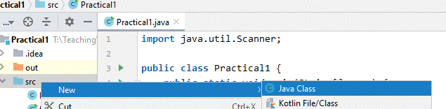

## Checkpoint 1

1. Copy and paste the code below into the <b><i>main</i></b> method. You may want to use the <i>"Paste Formatted"</i>
   from the *Edit* menu (or <kbd>Ctrl-Shift-V</kbd>) to maintain line breaks.

``` java
    Scanner in = new Scanner(System.in);
    String msg1, msg2, msg3;
    System.out.println("Enter a line");
    msg1 = in.nextLine();
    System.out.println("Enter another line");
    msg2 = in.nextLine();
    System.out.println("Enter the last line");
    msg3 = in.nextLine();
    System.out.println(msg3 + ", " + msg2 + ", " + msg1);
```

2. There will be errors because IntelliJ does not know about the `java.util.Scanner` class.
   Hover over the keyword *Scanner* (it should be red) and select *"Import class"*.
3. Run the program (e.g. click the *"Run Project button"*  or <kbd>Shift +
   F10</kbd>)
   and type in input as required. You will need to click in the window that appears below the source window to
   enter the input (the <b>Output window</b>). The Output window should end up containing something like
   (the input you should type in is in <b>bold</b>):

<pre><code>    Enter a line
    <b>Some input</b>
    Enter another line
    <b>More input</b>
    Enter the last line
    <b>The end</b>
    The end, More input, Some input
</code></pre>

Add line numbers to the output.

4. Modify the application so that each line of output is numbered, starting from 1. <br>**Do this in such a way that if
   you inserted another println/nextLine you would not need to re-number all the lines after that.**<br><br>

   **Hint:**<br> One way to do this is to use an integer variable to store the current line number and increase it by
   one each time you output a line.<br><br>
   After running the program, the output window should look like:
    <pre><code> 1: Enter a line
    <b>Some input</b>
    2: Enter another line
    <b>More input</b>
    3: Enter the last line
    <b>The end</b>
    The end, More input, Some input
    </code></pre>

---
## Checkpoint 2

Add a **class** to the application that stores a **line of input** and its **sequence number**.

1. Right-click on the "src" folder and select <kbd>"New -> Java class..."</kbd> (that is, add the class to the same
   package as the class `Practical1`). Change "Class Name" to `Line` and then press the <kbd><i>Enter</i></kbd>
   key.<br><br>
   <br><br>

2. Add appropriate instance variables (fields) and a constructor to the class so that a line of text (a `String`,
   called `text`) and, a sequence number (an `int`, called `seqNum`) can be stored. These instance variables should be "
   read only" for other classes. That is, they should be declared "`private`",
   and a "`getter`" method provided to return the value. Note that after declaring the instance variable, you can
   right-click on one of them, select "Generate" and then "Getter" to have the getter methods generated for you.<br><br>
3. Modify the `main` method of the class `Practical1` so that it stores each line of text and its sequence number in
   a `Line` object, rather than a `String` object. Modify the type of variables (msg1 etc.) as required. <br>**Note**
   that to print out a line, you will need to call the getter method. The output of your program should be exactly as
   before.<br><br>
   `The end, More input, Some input` <br><br>
4. Now change the program so that the sequence number is printed with the line. The <b>final</b> line of output should
   be:<br><br>
   `3: The end, 2: More input, 1: Some input`

Modify the program so that it uses a loops repeatedly doing:

- prompt for input (using line `seqNum` and the prompt phrase: <kbd>"Enter a line"</kbd>)
- reads the line of input
- stores the line of input in the next position of an <b>ArrayList</b>         of <b>`Line`</b>.

**Once the user enters STOP** (either: upper-case, lower-case or mixed-case) **as input**, the loop should terminate and
another loop should *print each line in **reverse order***, and on consecutive lines.<br>
For example (the input you should type in is in <b>bold</b>):
<pre><code>    1: Enter a line
    <b>Some input</b>
    2: Enter a line
    <b>More input</b>
    3: Enter a line
    <b>The end</b>
    4: Enter a line
    <b>STOP</b>
    3: The end
    2: More input
    1: Some input
</code></pre>

**hint**
to create an `ArrayList` of `Line` use:

```java
    ArrayList<Line> lineStore=new ArrayList<Line>();
        ...
        lineStore.add(msg); // where msg is an object of type Line
        ...
        lineStore.get(0); // to get the Line object at position 0
```

---
## Checkpoint 3

Build the initial version of a word list processing application.

1. Create a Java class called `Words` in your Practical1 project with the following contents:

```java
import javax.swing.JOptionPane;

public class Words {
   public static void main(String[] args) {
      WordList ws = new WordList();
      String in = JOptionPane.showInputDialog("Click cancel to end or enter a word and click OK");
      while (in != null) {
         ws.addWord(in);
         in = JOptionPane.showInputDialog("Click cancel to end or enter a word and click OK");
      }
      JOptionPane.showMessageDialog(null, "Word list = " + ws.toString());
      JOptionPane.showMessageDialog(null, "First word = " + ws.getFirst());
      JOptionPane.showMessageDialog(null, "Last word = " + ws.getLast());
   }
}
```

2. Create a Java class called `WordList` in your existing Practical1 project with the following contents:

```java
import java.util.ArrayList;

public class WordList {
   private ArrayList<String> theWordList = new ArrayList<>();

   public void addWord(String s) {
      theWordList.add(s);
   }

   /**
    * Gets the first word of theWordList,
    *
    * return the first word of the list, or "-" if the list is empty
    */
   public String getFirst() {
      return "junk";
   }

   /**
    * Gets the last word of theWordList,
    *
    * return the last word of the list, or "-" if the list is empty
    */
   public String getLast() {
      return "junk";
   }

   public String toString() {
      return theWordList.toString();
   }
}
```

3. Right-click in the source code window of the class `Words` and select <kbd>"Run File"</kbd>. Enter several words,
   clicking OK after each one and observe how the program behaves. Make sure you understand how the application
   works.<br><br>

4. In the class `WordList`, modify the methods `getFirst()` and `getLast()`
   as described by the associated header comments.

---
## Checkpoint 4

1. Modify the class `WordList` to include a method called `sortAlpha()` that sorts the list into ascending
   Alphabetical (dictionary) order.  
   **Hint:**  
   make use of the static method `sort(...)` of the class `Collections`.<br><br>

2. Modify the main method in the class Words so that _**after the list is printed**_, it is sorted (by making use of the
   new
   method) and then printed out again.

---
## Checkpoint 5

<span style="color:red;"><b>WARNING: Challenging!</b></span>

1. Modify the class `WordList` to include a method called `getAvgLength()` that returns the average length (a `double`)
   of words in the list (the sum of the lengths of all the words divided by the number of words in the list).
2. Display the average length using `JOptionPane.showMessageDialog(...)` at the end of the main method in the
   class `Words`.
3. Modify the class `WordList` to include a method called `sortByLength()` that sorts the list into ascending order
   based on the **length of words**. That is, after sorting, the shortest word should be first in the list, then the
   second shortest should be second in the list and so on, with the longest word at the end of the list.<br>
   - **_Create a new class_** that `implements Comparator` to achieve this.
4. Modify the main method in the class Words so that **_after the list is printed_**, it is sorted (by making use of
   the new method) and then printed out again.  
   **Hint:**  
   make use of `sort(...)` again, but use the two parameter version with a `Comparator` implementation.

---
   

